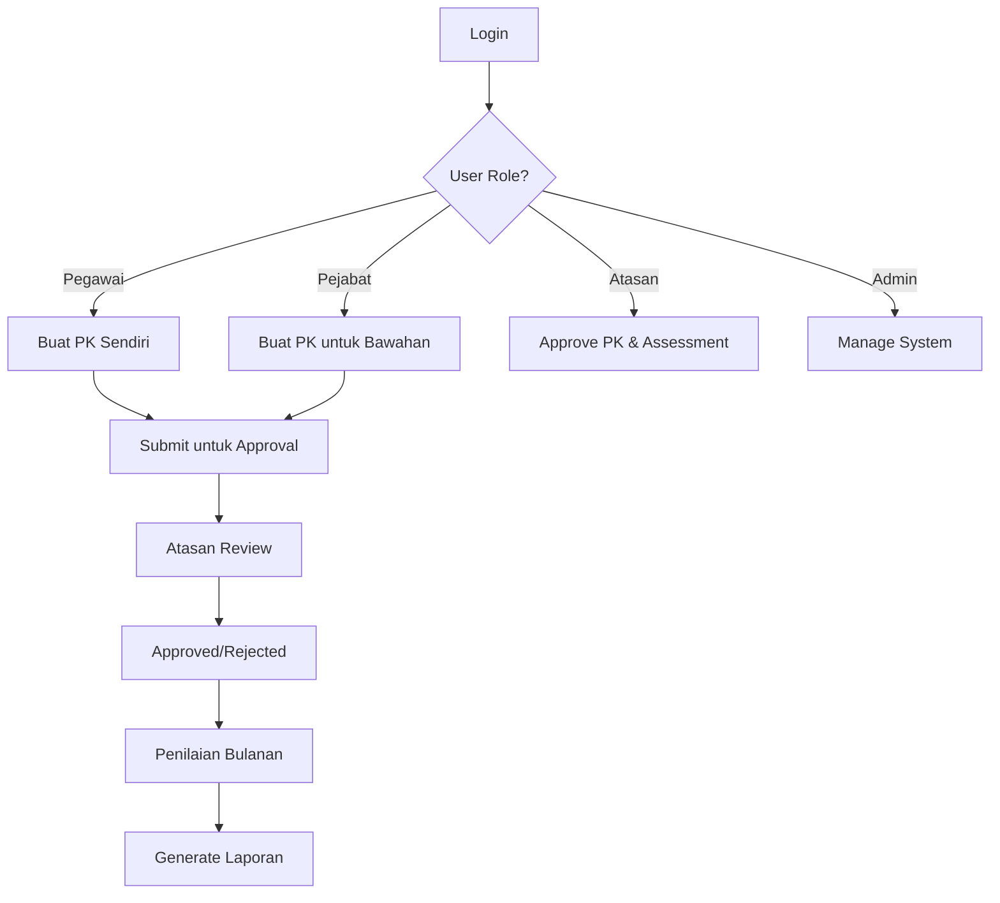

# 🚀 APP PKP - Sistem Manajemen Kinerja Pegawai

## Pengadilan Agama

<div align="center">

[](https://laravel.com)
[](https://vuejs.org)
[](https://mysql.com)
[](https://php.net)
[](https://opensource.org/licenses/MIT)

**Aplikasi Manajemen Kinerja Pegawai untuk Pengadilan Agama**

[📖 Manual Pengguna](./USER_MANUAL_APP_PKP.md) • [🚀 Panduan Cepat](./QUICK_REFERENCE_GUIDE.md) • [🔧 Instalasi](#instalasi--setup) • [📊 Demo](#demo)


_Dashboard utama aplikasi dengan overview kinerja pegawai_

</div>

---

## 📋 Daftar Isi

-   [🚀 Tentang APP PKP](#-tentang-app-pkp)
-   [✨ Fitur Utama](#-fitur-utama)
-   [🛠️ Tech Stack](#️-tech-stack)
-   [📋 Prerequisites](#-prerequisites)
-   [🚀 Instalasi & Setup](#-instalasi--setup)
-   [👤 Default User Accounts](#-default-user-accounts)
-   [📁 Project Structure](#-project-structure)
-   [🔐 User Roles & Permissions](#-user-roles--permissions)
-   [📄 PDF Templates](#-pdf-templates)
-   [📧 Email Notifications](#-email-notifications)
-   [📥 Data Import](#-data-import)
-   [🧪 Testing](#-testing)
-   [🚀 Deployment](#-deployment)
-   [📈 Performance Optimization](#-performance-optimization)
-   [🔧 Troubleshooting](#-troubleshooting)
-   [📞 Support & Contact](#-support--contact)
-   [📋 Changelog](#-changelog)
-   [🙏 Acknowledgments](#-acknowledgments)

---

## 🚀 Tentang APP PKP

**APP PKP (Perjanjian Kinerja Pegawai)** adalah aplikasi manajemen kinerja pegawai yang dirancang khusus untuk instansi pemerintah, khususnya Pengadilan Agama. Sistem ini mengelola perjanjian kinerja individu pegawai dan menghasilkan laporan dalam format PDF sesuai standar pemerintahan.

### 🎯 Tujuan Utama

-   ✅ **Mengoptimalkan proses penilaian kinerja** pegawai
-   ✅ **Otomasi workflow approval** perjanjian kinerja
-   ✅ **Generate laporan profesional** sesuai standar pemerintah
-   ✅ **Self-service untuk pegawai** dalam mengelola PK pribadi
-   ✅ **Monitoring kinerja real-time** untuk manajemen

### ✨ Fitur Utama

| Kategori              | Fitur              | Deskripsi                                             |
| --------------------- | ------------------ | ----------------------------------------------------- |
| 🔐 **Authentication** | Multi-Role System  | 4 level akses (Super Admin, Pejabat, Atasan, Pegawai) |
| 📋 **PK Management**  | Perjanjian Kinerja | CRUD PK dengan workflow approval                      |
| 📊 **Assessment**     | Penilaian Bulanan  | Auto-calculation nilai dengan grade                   |
| 📄 **Reporting**      | PDF Generation     | 3 template laporan government-compliant               |
| 📎 **Documents**      | File Management    | Upload & storage dokumen pendukung                    |
| 📧 **Notifications**  | Email System       | Automated notifications untuk semua workflow          |
| 📥 **Import**         | Bulk Data          | Excel import untuk data pegawai                       |
| 📈 **Dashboard**      | Analytics          | Real-time monitoring & statistics                     |
| 🔍 **Search**         | Advanced Filtering | Multi-criteria search & filter                        |

### 🎨 Antarmuka Modern

-   **Responsive Design** - Kompatibel desktop & mobile
-   **Intuitive UX** - User-friendly interface
-   **Real-time Updates** - Live data synchronization
-   **Professional UI** - Government-grade appearance

---

## 📊 Demo

### 🎥 Screenshots

<div align="center">

#### Dashboard Overview


_Dashboard utama dengan statistik kinerja_

#### Perjanjian Kinerja


_Manajemen Perjanjian Kinerja Individual_

#### Penilaian Bulanan


_Form penilaian kinerja bulanan_

#### Laporan PDF


_Contoh laporan PDF yang dihasilkan_

</div>

### 🎮 Quick Demo

Untuk mencoba aplikasi secara lokal:

```bash
# 1. Clone repository
git clone https://github.com/your-repo/app-pkp.git
cd app-pkp

# 2. Quick setup (gunakan script jika tersedia)
./setup.sh

# 3. Atau manual setup
composer install && npm install
cp .env.example .env
php artisan key:generate
php artisan migrate --seed

# 4. Jalankan aplikasi
php artisan serve &
npm run dev &

# 5. Akses http://localhost:8000
# Login dengan akun default di bawah
```

---

## 🛠️ Tech Stack

-   **Backend:** Laravel 12, PHP 8.2+
-   **Frontend:** Vue.js 3, Inertia.js
-   **Database:** MySQL 8.0+
-   **PDF Generation:** DomPDF
-   **Authentication:** Laravel Sanctum
-   **Styling:** Tailwind CSS

---

## 📋 Prerequisites

### System Requirements

-   **PHP:** 8.2 or higher
-   **Node.js:** 16.x or higher
-   **MySQL:** 8.0 or higher
-   **Composer:** Latest version
-   **NPM:** Latest version

### Hardware Requirements

-   **RAM:** Minimum 4GB
-   **Storage:** Minimum 10GB free space
-   **Processor:** Intel Core i3 or equivalent

---

## 🚀 Quick Start

### ⚡ One-Command Setup (Recommended)

```bash
# Clone & Setup dalam 1 perintah
git clone https://github.com/your-repo/app-pkp.git && cd app-pkp
composer install && npm install
cp .env.example .env && php artisan key:generate
# Configure database di .env file
php artisan migrate --seed
npm run build && php artisan storage:link
php artisan serve
```

### 🎯 Manual Installation

#### 1. 📥 Clone Repository

```bash
git clone https://github.com/your-repo/app-pkp.git
cd app-pkp
```

#### 2. 🔧 Install Dependencies

```bash
# PHP Dependencies
composer install

# Node.js Dependencies
npm install
```

#### 3. ⚙️ Environment Setup

```bash
# Copy environment file
cp .env.example .env

# Generate application key
php artisan key:generate
```

#### 4. 🗄️ Database Configuration

```bash
# Edit .env file dengan konfigurasi database
nano .env

# Contoh konfigurasi:
DB_CONNECTION=mysql
DB_HOST=127.0.0.1
DB_PORT=3306
DB_DATABASE=app_pkp
DB_USERNAME=root
DB_PASSWORD=your_password
```

#### 5. 🏗️ Database Setup

```bash
# Run migrations
php artisan migrate

# Seed dengan data default
php artisan db:seed
```

#### 6. 🎨 Build Assets

```bash
# Build frontend assets
npm run build

# Create storage link
php artisan storage:link
```

#### 7. ▶️ Start Application

```bash
# Terminal 1: Laravel Server
php artisan serve

# Terminal 2: Vite Dev Server (untuk development)
npm run dev

# Terminal 3: Queue Worker (untuk email)
php artisan queue:work
```

#### 8. 🌐 Access Application

Open browser dan akses: **`http://localhost:8000`**

---

## 🔧 Development Setup

### 🐳 Docker Setup (Optional)

```bash
# Menggunakan Laravel Sail
./vendor/bin/sail up -d

# Setup database
./vendor/bin/sail artisan migrate --seed

# Build assets
./vendor/bin/sail npm run build
```

### 🔄 Development Workflow

```bash
# Jalankan semua service sekaligus
npm run dev        # Vite dev server
php artisan serve  # Laravel server
php artisan queue:work  # Queue worker
```

### 🧪 Testing Setup

```bash
# Run all tests
php artisan test

# Run with coverage
php artisan test --coverage

# Run specific test
php artisan test --filter=UserTest
```

---

## 👤 Default User Accounts

Setelah seeding database, Anda dapat login menggunakan akun berikut:

### 🔑 Login Credentials

| Role                   | Email                 | Password   | Akses                    |
| ---------------------- | --------------------- | ---------- | ------------------------ |
| 👑 **Super Admin**     | `superadmin@pkp.test` | `password` | Full system access       |
| 👨‍💼 **Pejabat Penilai** | `pejabat@pkp.test`    | `password` | Assessment & PK creation |
| 👔 **Atasan Pejabat**  | `atasan@pkp.test`     | `password` | Approval workflow        |
| 👤 **Pegawai**         | `pegawai@pkp.test`    | `password` | Self-service PK          |
| 👥 **Pegawai 2**       | `pegawai2@pkp.test`   | `password` | Self-service PK          |

### 🎯 Usage Examples

#### **Untuk Pegawai:**

```bash
# Login sebagai pegawai
Email: pegawai@pkp.test
Password: password

# Workflow:
1. Buat Perjanjian Kinerja → Menu "Perjanjian Kinerja"
2. Isi sasaran kerja → Submit untuk approval
3. Lakukan penilaian bulanan → Upload dokumen
4. Monitor progress → Dashboard pribadi
```

#### **Untuk Pejabat Penilai:**

```bash
# Login sebagai pejabat
Email: pejabat@pkp.test
Password: password

# Workflow:
1. Buat PK untuk bawahan → Menu "Perjanjian Kinerja"
2. Lakukan penilaian bulanan → Input realisasi
3. Upload dokumen pendukung → Validasi data
4. Submit untuk approval atasan
```

#### **Untuk Atasan:**

```bash
# Login sebagai atasan
Email: atasan@pkp.test
Password: password

# Workflow:
1. Review PK pending → Approve/Reject
2. Approve penilaian bulanan → Final approval
3. Generate laporan → PDF export
4. Monitor kinerja unit → Analytics dashboard
```

### 🔐 Password Reset

Untuk mengubah password default:

1. Login dengan akun yang ada
2. Akses **Profile** → **Update Password**
3. Masukkan password lama dan password baru
4. Klik **Update Password**

---

## 🎮 Getting Started Guide

### 📋 Quick Workflow Overview



### 🚀 First Time Setup

1. **Clone Repository**

    ```bash
    git clone https://github.com/your-repo/app-pkp.git
    cd app-pkp
    ```

2. **Install & Configure**

    ```bash
    composer install
    npm install
    cp .env.example .env
    php artisan key:generate
    # Configure database in .env
    php artisan migrate --seed
    ```

3. **Start Application**

    ```bash
    php artisan serve &
    npm run dev &
    ```

4. **Login & Explore**
    - Akses `http://localhost:8000`
    - Login dengan salah satu akun default
    - Explore fitur sesuai role Anda

---

## 📁 Project Structure

```
app-pkp/
├── app/
│   ├── Http/
│   │   ├── Controllers/          # API & Web Controllers
│   │   ├── Middleware/           # Custom Middleware
│   │   └── Requests/             # Form Request Validation
│   ├── Models/                   # Eloquent Models
│   ├── Mail/                     # Email Templates
│   └── Imports/                  # Excel Import Classes
├── database/
│   ├── migrations/               # Database Migrations
│   ├── seeders/                  # Database Seeders
│   └── factories/                # Model Factories
├── resources/
│   ├── js/                       # Vue.js Components
│   ├── css/                      # Stylesheets
│   └── views/                    # Blade Templates & PDF
├── routes/
│   ├── api.php                   # API Routes
│   └── web.php                   # Web Routes
├── storage/
│   ├── app/                      # File Storage
│   └── templates/                # Import Templates
├── tests/                        # Test Files
├── config/                       # Configuration Files
├── public/                       # Public Assets
├── bootstrap/                    # Laravel Bootstrap
├── artisan                       # Laravel CLI
├── composer.json                 # PHP Dependencies
├── package.json                  # Node Dependencies
└── vite.config.js               # Vite Configuration
```

---

## 🔧 Configuration

### Environment Variables

Key configuration options in `.env`:

```env
# Application
APP_NAME="APP PKP"
APP_ENV=local
APP_KEY=base64_key_here
APP_DEBUG=true
APP_URL=http://localhost

# Database
DB_CONNECTION=mysql
DB_HOST=127.0.0.1
DB_PORT=3306
DB_DATABASE=app_pkp
DB_USERNAME=root
DB_PASSWORD=

# Mail Configuration
MAIL_MAILER=smtp
MAIL_HOST=mailpit
MAIL_PORT=1025
MAIL_USERNAME=null
MAIL_PASSWORD=null
MAIL_ENCRYPTION=null
MAIL_FROM_ADDRESS="noreply@pkp.test"
MAIL_FROM_NAME="${APP_NAME}"

# Queue Configuration
QUEUE_CONNECTION=database

# Cache Configuration
CACHE_STORE=database
```

### Queue Configuration

For email notifications, configure queue:

```bash
# Run queue worker
php artisan queue:work

# Or use supervisor for production
# See: https://laravel.com/docs/queues#supervisor-configuration
```

---

## 📊 Database Schema

### Core Tables

-   **users** - User accounts with roles
-   **employees** - Employee master data
-   **work_units** - Organizational units
-   **performance_agreements** - PK documents
-   **performance_targets** - PK targets
-   **monthly_assessments** - Monthly evaluations
-   **assessment_details** - Assessment breakdowns
-   **documents** - File attachments

### Key Relationships

```
User (1) ──── (1) Employee
Employee (1) ──── (N) PerformanceAgreement
PerformanceAgreement (1) ──── (N) PerformanceTarget
PerformanceAgreement (1) ──── (N) MonthlyAssessment
MonthlyAssessment (1) ──── (N) AssessmentDetail
MonthlyAssessment (1) ──── (N) Document
```

---

## 🔐 User Roles & Permissions

### 1. Super Admin

-   ✅ Full system access
-   ✅ Manage all users and data
-   ✅ Configure system settings
-   ✅ Generate all reports

### 2. Pejabat Penilai (Assessor)

-   ✅ Create PK for subordinates
-   ✅ Conduct monthly assessments
-   ✅ Upload supporting documents
-   ✅ View assigned employee data

### 3. Atasan Pejabat Penilai (Supervisor)

-   ✅ Approve performance agreements
-   ✅ Final approve monthly assessments
-   ✅ View unit performance reports
-   ✅ Monitor team performance

### 4. Pegawai (Employee)

-   ✅ Self-service PK creation
-   ✅ Self-assessment monthly
-   ✅ Upload personal documents
-   ✅ View personal performance data

---

## 📄 PDF Templates

The system includes 3 professional PDF templates:

1. **Perjanjian Kinerja Individual** - Performance agreement document
2. **Penilaian Capaian Kinerja Bulanan** - Monthly assessment report
3. **Rekapitulasi Penilaian Capaian Kinerja** - Annual performance summary

Templates are located in `resources/views/pdf/` and use DomPDF for generation.

---

## 📧 Email Notifications

### Notification Types

-   **PK Approved** - Sent to employee when PK is approved
-   **PK Rejected** - Sent to employee with rejection reason
-   **Assessment Submitted** - Sent to supervisor for approval
-   **Assessment Approved** - Sent to employee when assessment is approved

### Email Templates

Located in `app/Mail/`:

-   `PerformanceAgreementApproved.php`
-   `PerformanceAgreementRejected.php`

---

## 📥 Data Import

### Employee Import

1. Download template: `storage/app/templates/employee_import_template.xlsx`
2. Fill employee data according to format
3. Upload via: Menu Pegawai → Import Data
4. System validates and imports data

### Import Format

```csv
nip,nama,pangkat_golongan,jabatan,unit_kerja_id,status,tanggal_masuk
198501012010011001,AHMAD RAHMAN,Pembina Tk. I / IV.b,Juru Sita,1,active,2010-01-01
```

---

## 🧪 Testing

### Run Tests

```bash
# Run all tests
php artisan test

# Run specific test
php artisan test --filter=UserTest

# Run with coverage
php artisan test --coverage
```

### Test Structure

```
tests/
├── Feature/          # Feature tests
├── Unit/            # Unit tests
└── TestCase.php     # Base test case
```

---

## 🚀 Deployment

### Production Setup

1. **Server Requirements:**

    - Ubuntu 20.04+ / CentOS 8+
    - PHP 8.2+ with required extensions
    - MySQL 8.0+
    - Nginx/Apache
    - SSL Certificate

2. **Deployment Steps:**

    ```bash
    # Clone to production server
    git clone https://github.com/your-repo/app-pkp.git /var/www/app-pkp
    cd /var/www/app-pkp

    # Install dependencies
    composer install --optimize-autoloader --no-dev
    npm install && npm run build

    # Environment setup
    cp .env.example .env
    php artisan key:generate
    php artisan config:cache
    php artisan route:cache
    php artisan view:cache

    # Database setup
    php artisan migrate --force
    php artisan db:seed --force

    # Storage setup
    php artisan storage:link

    # Queue setup
    php artisan queue:table
    php artisan migrate
    ```

3. **Web Server Configuration:**

    ```nginx
    server {
        listen 80;
        server_name pkp-app.test;
        root /var/www/app-pkp/public;

        location / {
            try_files $uri $uri/ /index.php?$query_string;
        }

        location ~ \.php$ {
            fastcgi_pass unix:/var/run/php/php8.2-fpm.sock;
            fastcgi_param SCRIPT_FILENAME $realpath_root$fastcgi_script_name;
            include fastcgi_params;
        }
    }
    ```

4. **SSL Setup:**

    ```bash
    certbot --nginx -d pkp-app.test
    ```

5. **Queue Worker:**
    ```bash
    # Using Supervisor
    sudo apt install supervisor
    # Configure supervisor for Laravel queues
    ```

---

## 📈 Performance Optimization

### Database Optimization

-   ✅ Indexes on frequently queried columns
-   ✅ Eager loading for relationships
-   ✅ Query optimization with select columns

### Caching Strategy

-   ✅ Response caching (10-minute TTL)
-   ✅ Database query result caching
-   ✅ Configuration caching

### File Storage

-   ✅ Optimized file upload handling
-   ✅ Secure file storage with access control
-   ✅ Automatic file cleanup

---

## 🔧 Troubleshooting

### Common Issues

1. **Login Issues:**

    ```bash
    # Clear cache
    php artisan cache:clear
    php artisan config:clear
    ```

2. **Permission Issues:**

    ```bash
    # Fix storage permissions
    chown -R www-data:www-data storage/
    chmod -R 755 storage/
    ```

3. **Database Issues:**

    ```bash
    # Reset database
    php artisan migrate:fresh --seed
    ```

4. **Asset Issues:**
    ```bash
    # Rebuild assets
    npm run build
    php artisan storage:link
    ```

---

## 🤝 Contributing

Kami menyambut kontribusi dari komunitas! Berikut cara berkontribusi:

### 📝 How to Contribute

1. **Fork** repository ini
2. **Create** feature branch (`git checkout -b feature/AmazingFeature`)
3. **Commit** changes (`git commit -m 'Add some AmazingFeature'`)
4. **Push** to branch (`git push origin feature/AmazingFeature`)
5. **Open** Pull Request

### 🐛 Bug Reports & Feature Requests

-   **Bug Reports:** [GitHub Issues](https://github.com/your-repo/app-pkp/issues)
-   **Feature Requests:** [GitHub Discussions](https://github.com/your-repo/app-pkp/discussions)
-   **Security Issues:** [security@pkp-app.test](mailto:security@pkp-app.test)

### 📋 Development Guidelines

-   ✅ Follow PSR-12 coding standards
-   ✅ Write tests for new features
-   ✅ Update documentation
-   ✅ Ensure backward compatibility
-   ✅ Use meaningful commit messages

---

## 📞 Support & Contact

### 📚 Documentation

-   📖 **[Manual Pengguna Lengkap](./USER_MANUAL_APP_PKP.md)** - Panduan detail untuk semua fitur
-   🚀 **[Panduan Cepat](./QUICK_REFERENCE_GUIDE.md)** - Referensi singkat dan shortcuts
-   📋 **[README Teknik](./README.md)** - Dokumentasi teknis dan instalasi

### 🆘 Help & Support

| Channel                 | Contact                                                                | Response Time |
| ----------------------- | ---------------------------------------------------------------------- | ------------- |
| **📧 Email Support**    | [support@pkp-app.test](mailto:support@pkp-app.test)                    | 24-48 jam     |
| **🐛 Bug Reports**      | [GitHub Issues](https://github.com/your-repo/app-pkp/issues)           | 24 jam        |
| **💡 Feature Requests** | [GitHub Discussions](https://github.com/your-repo/app-pkp/discussions) | 48 jam        |
| **📱 Live Chat**        | [WhatsApp Support](https://wa.me/6281234567890)                        | 1-4 jam       |

### 👥 Team Contacts

| Role                    | Name             | Contact                                               |
| ----------------------- | ---------------- | ----------------------------------------------------- |
| **👨‍💼 Project Manager**  | Rahmat Triadi    | [rahmat@pkp-app.test](mailto:rahmat@pkp-app.test)     |
| **👨‍💻 Technical Lead**   | Development Team | [dev@pkp-app.test](mailto:dev@pkp-app.test)           |
| **🎯 Product Owner**    | Management       | [po@pkp-app.test](mailto:po@pkp-app.test)             |
| **🔐 Security Officer** | Security Team    | [security@pkp-app.test](mailto:security@pkp-app.test) |

### 🕒 Service Hours

-   **Senin - Jumat:** 08:00 - 17:00 WIB
-   **Sabtu:** 08:00 - 12:00 WIB
-   **Minggu:** Emergency only
-   **Response Time:** 24-48 jam untuk issues non-urgent

---

## 🌟 Show Your Support

Jika project ini bermanfaat untuk Anda, berikan dukungan dengan:

-   ⭐ **Star** repository ini
-   🍴 **Fork** dan kontribusi
-   📢 **Share** ke rekan kerja
-   💝 **Donate** untuk development

---

## 📈 Roadmap

### ✅ Version 1.0.0 (Current)

-   ✅ Complete PK management system
-   ✅ Multi-role authentication
-   ✅ PDF report generation
-   ✅ Email notifications
-   ✅ Bulk import functionality

### 🚧 Version 1.1.0 (Upcoming)

-   🔄 Advanced analytics dashboard
-   📱 Mobile app companion
-   🤖 AI-powered recommendations
-   🔗 Integration with SIMPEG
-   📊 Advanced reporting features

### 🎯 Version 2.0.0 (Future)

-   🌐 Multi-institution support
-   🎨 Customizable themes
-   📊 Predictive analytics
-   🔄 API for third-party integrations
-   🎯 Advanced workflow automation

---

## 📋 Changelog

### Version 1.0.0 (2025-01-14)

-   ✅ Initial release
-   ✅ Complete PK management system
-   ✅ Multi-role authentication
-   ✅ PDF report generation
-   ✅ Email notifications
-   ✅ Bulk import functionality
-   ✅ Performance optimizations

---

## 📄 License

This project is licensed under the **MIT License** - see the [LICENSE](LICENSE) file for details.

---

## 🙏 Acknowledgments

Terima kasih kepada teknologi dan tools yang membuat project ini mungkin:

### 🛠️ Core Technologies

-   **[Laravel Framework](https://laravel.com)** - The PHP framework for web artisans
-   **[Vue.js](https://vuejs.org)** - Progressive JavaScript framework
-   **[Inertia.js](https://inertiajs.com)** - Modern monolith architecture
-   **[DomPDF](https://dompdf.github.io)** - PDF generation library
-   **[Tailwind CSS](https://tailwindcss.com)** - Utility-first CSS framework

### 📚 Supporting Libraries

-   **[Laravel Sanctum](https://laravel.com/docs/sanctum)** - API authentication
-   **[Laravel Excel](https://laravel-excel.com)** - Excel import/export
-   **[Spatie Permission](https://spatie.be/docs/laravel-permission)** - Role management
-   **[Intervention Image](https://image.intervention.io)** - Image processing

### 👥 Special Thanks

-   **Pengadilan Agama** - For the opportunity and requirements
-   **Laravel Community** - For excellent documentation and support
-   **Open Source Community** - For amazing tools and libraries

---

## 🔗 Links & Resources

### 📖 Documentation

-   [📋 User Manual](./USER_MANUAL_APP_PKP.md)
-   [🚀 Quick Reference](./QUICK_REFERENCE_GUIDE.md)
-   [🛠️ API Documentation](./docs/api.md)
-   [📊 Database Schema](./docs/schema.md)

### 🌐 External Links

-   [🏛️ Pengadilan Agama](https://pengadilan-agama.go.id)
-   [📚 Laravel Docs](https://laravel.com/docs)
-   [🎨 Vue.js Docs](https://vuejs.org/guide)
-   [📄 DomPDF Docs](https://dompdf.github.io)

### 📱 Social & Community

-   [🐙 GitHub Repository](https://github.com/your-repo/app-pkp)
-   [💼 LinkedIn](https://linkedin.com/company/pengadilan-agama)
-   [🐦 Twitter](https://twitter.com/pkp_app)
-   [📧 Newsletter](https://pkp-app.test/newsletter)

---

<div align="center">

## 🏛️ APP PKP - Sistem Manajemen Kinerja Pegawai

**Pengadilan Agama Indonesia**

---

### 🎯 Mission

_Menjadi solusi terdepan dalam manajemen kinerja pegawai untuk instansi pemerintah Indonesia_

### 💡 Vision

_Mewujudkan sistem manajemen kinerja yang transparan, efisien, dan sesuai standar pemerintah_

---

**📧 Contact:** [info@pkp-app.test](mailto:info@pkp-app.test) | **📱 WhatsApp:** [+62 812-3456-7890](https://wa.me/6281234567890)

**🌐 Website:** [https://pkp-app.test](https://pkp-app.test) | **📍 Location:** Jakarta, Indonesia

---

**Developed with ❤️ by Rahmat Triadi for efficient performance management**

**© 2025 APP PKP - All Rights Reserved**

[](https://github.com/your-repo/app-pkp)
[](https://github.com/your-repo/app-pkp/fork)

</div>
